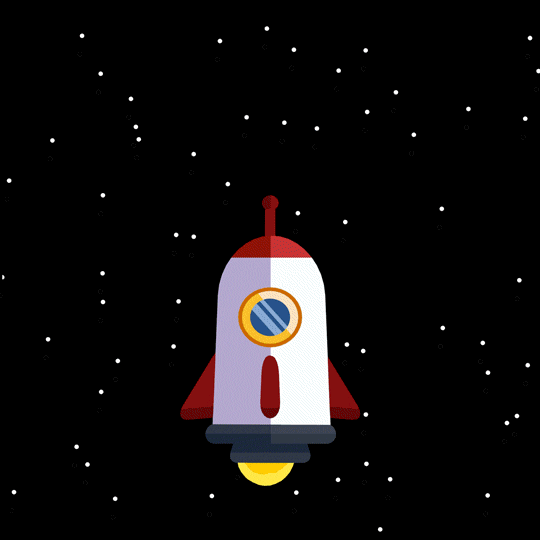

# React-Mastering-100

👨‍💻Learning and Mastering React.js. 100 days Challenge!

# Day 1 (components)🚀 => lesson1 branch

# Day 2 (props)🚀 => lesson2 branch

# Day 2 (components & props simple project)🚀 => lesson3 branch

# Day 3 (state)🚀 => lesson4 branch

# Day 4 (useState in details) => lesson5 branch
<!--  -->

    
    
    

